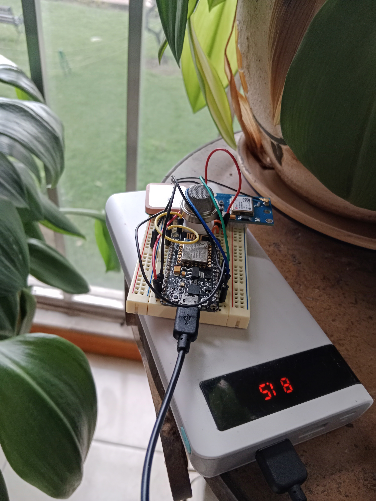
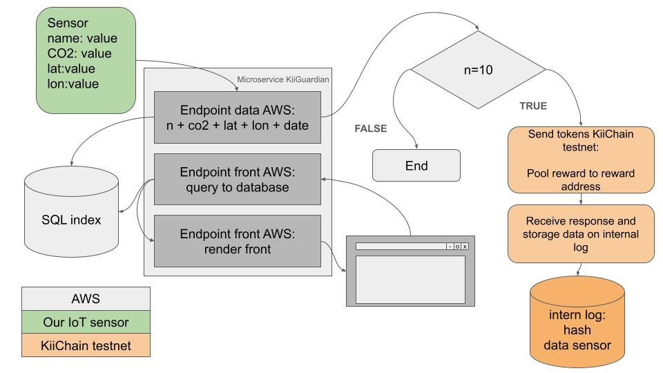

# KiiGuardian

## How It Works

**KiiGuardian** is a blockchain-based project that leverages an IoT device to measure carbon dioxide (CO2) concentration and track CO2 emissions across various locations. The solution operates through four key steps:

1. **IoT Device**: KiiGuardian employs an IoT device to measure CO2 levels. This device can be installed in a variety of locations, such as homes, offices, vehicles, bicycles, and more.

2. **Connection to the Blockchain Network**: Once the IoT device is installed, it connects to the blockchain network to perform transactions. The blockchain network acts as a decentralized and secure database, recording all transactions.

3. **Measurement and Tracking of CO2 Emissions**: The IoT device measures CO2 concentration and tracks CO2 emissions across different locations. The data collected is used to create a global map of CO2 concentration, raising awareness about climate change and encouraging people to reduce their carbon footprint.

4. **Reward System**: KiiGuardian implements a reward system to incentivize users to lower their carbon footprint. When users reduce their CO2 emissions below a specific target, a transfer is made from the grant account to the stake account, awarding tokens as a reward for their efforts.

## Hardware

The microcontroller chosen for this project is the **ESP32**, selected for its low power consumption and built-in Wi-Fi connectivity. To measure CO2 levels, an **MQ135 sensor** is connected to one of the analog inputs of the ESP32.

## Software

The entire backend of the application is developed in **Python**, utilizing **ether.js** for blockchain connectivity. **FastAPI** is used to create the endpoints, while the frontend is built with **Bootstrap**. The **KiiChain testnet** was used for testing purposes.

## Infrastructure

